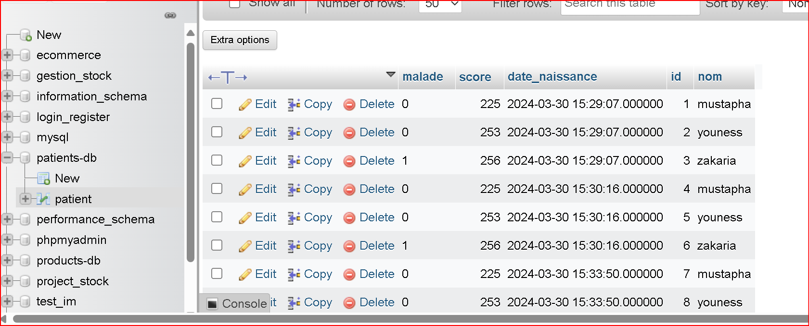
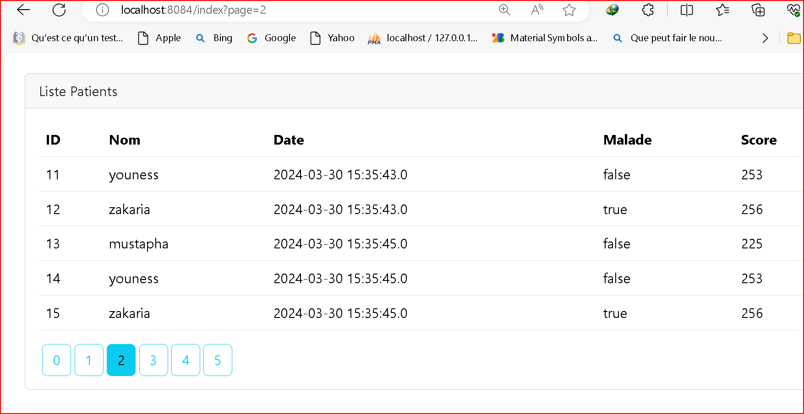
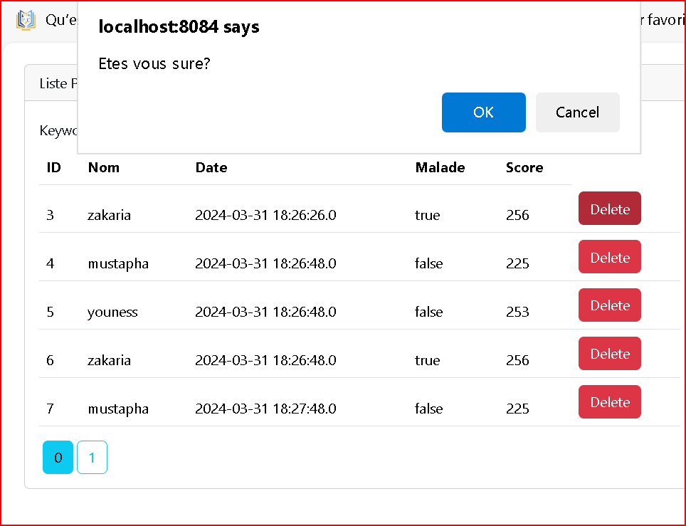
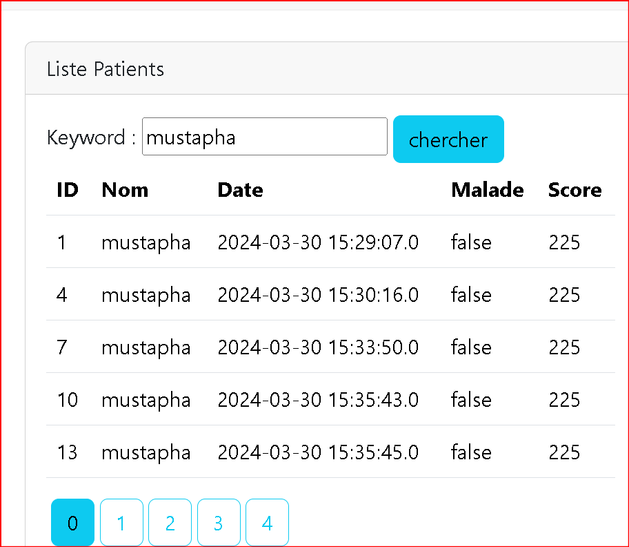
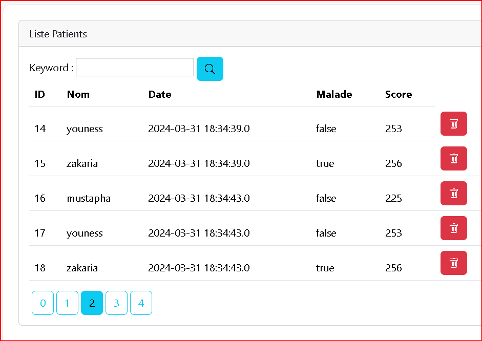
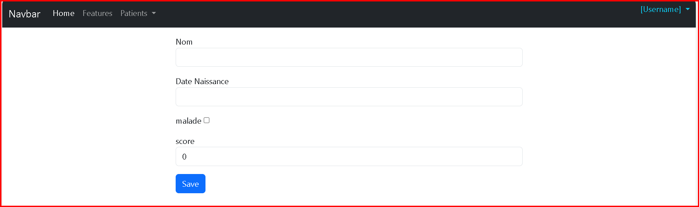
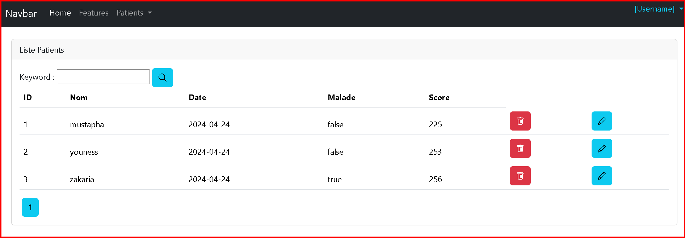
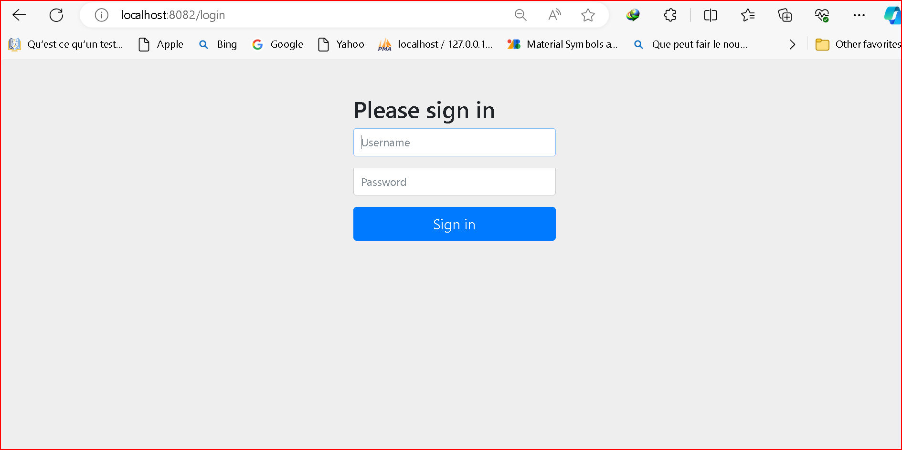

# Part 1-Demo Spring MVC Thylemeaf Spring Data JP

## migrationDBMysql

## Liste Patients

## suppersion avec confirmatio

## Chercher

## Ajouter Icons

## Formulaire de Patients

## Page Home Avec Navbar

### Add security login page 

### Modifie Navbar login with name user

